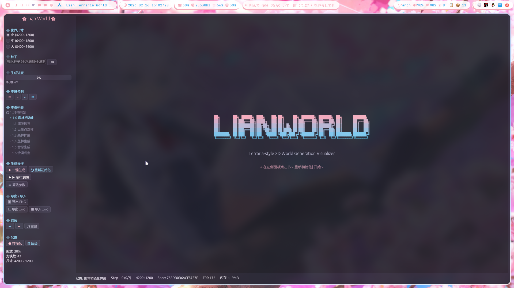
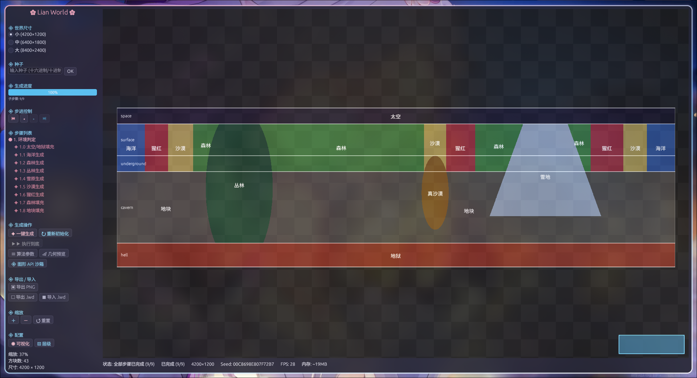
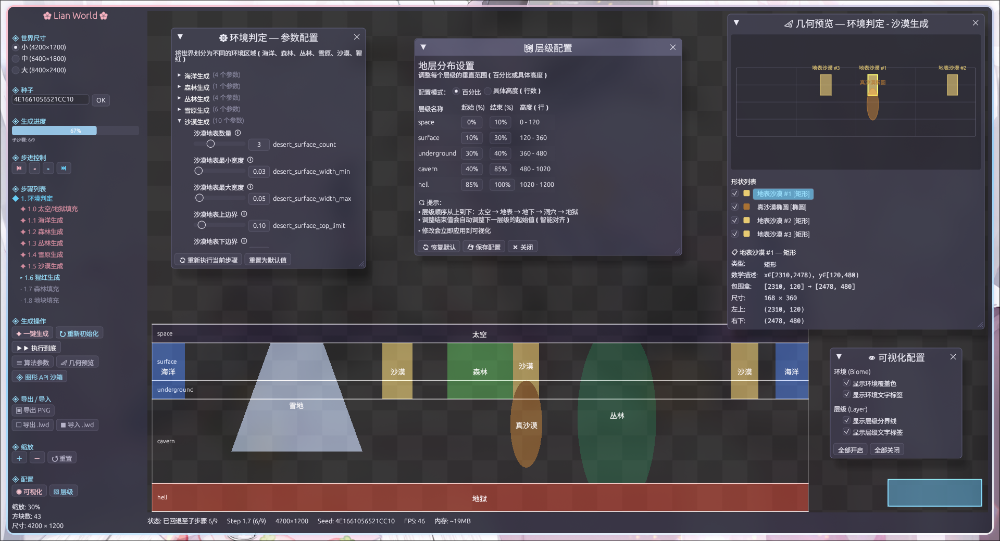
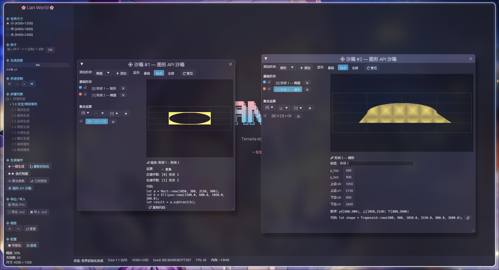

<div align="center">

# LianWorld

</div>

| | |
|-|-|
|  |  |
|  |  |

> 受 Terraria 启发的 2D 世界生成可视化工具 — 用于研究、调试和演示程序化世界生成算法。

## 特性

- **分步生成** — 逐步骤正向/反向执行，实时观察世界构建过程
- **元数据驱动** — 算法自描述参数，GUI 自动生成编辑控件
- **数据驱动配置** — 方块、环境、世界尺寸、层级均从 JSON 配置读取，UI 动态渲染
- **确定性重放** — 相同种子 + 参数 + 世界尺寸 = 完全相同的世界
- **手动种子输入** — 支持十六进制（`0x` 前缀）、纯十六进制、十进制格式
- **存档系统** — `.lwd` 快照导出/导入（只存 seed + params，不存方块）
- **PNG 导出** — 1:1 像素导出世界图像
- **覆盖层可视化** — 环境覆盖色/文字、层级分界线/文字，4 项独立开关
- **几何图形 API** — Shape trait + 4 种基础形状 + Union/Intersect/Subtract 组合器
- **几何预览窗口** — 展示当前步骤的所有几何形状（mini-canvas + 形状列表 + 详细参数）
- **图形 API 沙箱** — 多实例交互式形状创建/组合/预览，支持集合运算 + 代码生成
- **GPU 渲染** — PaintCallback + glow OpenGL 管线，视口裁剪 + 动态 LOD
- **粉蓝白主题** — 全局统一配色方案
- **启动画面** — ASCII 艺术 "LIANWORLD" 粉→蓝渐变展示
- **缩略地图** — 画布右下角实时世界缩略图 + 视口指示器

## 技术栈

| 组件 | 技术 |
|------|------|
| 语言 | Rust 2024 Edition |
| GUI | egui / eframe 0.27 (glow) |
| GPU | glow 0.13 (OpenGL) |
| 并行 | rayon 1.10 |
| 序列化 | serde / serde_json |
| 随机数 | rand 0.8 (StdRng) |
| 噪声 | noise 0.9 |
| 图像 | image 0.25 |
| 文件对话框 | rfd 0.15 |

## 安装

### 从 Release 下载（推荐）

前往 [Release](build/) 页面下载对应平台的二进制包，无需安装 Rust 工具链：

| 平台 | 文件 |
|------|------|
| Linux x86_64 | `Lwd_<version>_linux_x86_64` |
| Windows x86_64 | `Lwd_<version>_windows_x86_64.exe` |

下载后直接运行即可（Linux 需 `chmod +x`）。

### 从源码构建

```bash
# 构建
cargo build --release

# 运行
cargo run --release
```

交叉编译 Windows 版本：

```bash
cargo build --release --target x86_64-pc-windows-gnu
```

## 项目规模

- ~8700 行引擎源码（不含算法模块）
- ~51 个源文件
- 43 种方块 / 10 种环境 / 3 种预设世界尺寸 + 自定义尺寸
- 9 个生成步骤 / 4 种几何图形 / 3 种集合运算

## 持久化

所有运行时数据存储在 `~/.local/share/lwd/`（遵循 XDG 规范）：

```
~/.local/share/lwd/
├── runtime.json        ← 统一配置（引擎调优 + 层级 + UI 状态）
└── logs/
    └── perf_*.json     ← 生成性能日志（自动清理，默认保留 100 条）
```

## 详细文档

→ [docs/README.md](docs/README.md)
